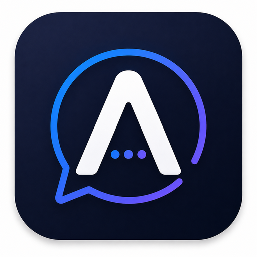

# ⚡ Aerio

  

  <strong>A privacy-focused, real-time messaging platform built for the web and Android.</strong>

  <a href="https://aerio-delta.vercel.app">Live App</a> ·
  <a href="https://github.com/maazcrafts/Aerio/issues">Issues</a> ·
  <a href="https://github.com/maazcrafts/Aerio">Source</a>

  
  
  
  
  

---

## What is Aerio?

**Aerio** is a full-stack messaging application designed around three ideas:

> **Real-time communication. Private direct messages. One consistent experience across devices.**

It combines a React/Vite client, a Node.js + Express API, Socket.IO for live communication, PostgreSQL for persistence, and Capacitor for Android packaging.

The project also implements a **direct-message E2EE layer using NaCl box primitives via \`tweetnacl\`**. Private keys are generated and retained on the device; the backend receives public keys rather than private keys.

**Live:** https://aerio-delta.vercel.app

---

## ✦ Core Capabilities

| Area | Capability |
|---|---|
| 💬 Messaging | Real-time 1:1 conversations and group messaging |
| 🔐 Privacy | Direct-message E2EE architecture with device-held private keys |
| ⚡ Real-time | Socket.IO events for live messaging and presence |
| 🔑 Identity | Device-based encryption keys with multi-device support |
| 👤 Accounts | Authentication, profiles and online status |
| 📎 Media | Attachments, images, voice notes and GIF integration |
| 🔔 Notifications | Push notification infrastructure for supported devices |
| 📱 Mobile | Android application through Capacitor |
| 🎨 UI | Responsive dark interface with animated interactions |

> **E2EE scope:** the current encryption implementation is for **direct 1:1 messages**. Group-message encryption is not currently covered by that E2EE layer.

---

## 🧠 Architecture

\`\`\`mermaid
flowchart LR
    A["Web Client React + Vite"] --> C["API + Realtime Node.js + Express + Socket.IO"]
    B["Android Client Capacitor"] --> C
    A --> D["Device E2EE tweetnacl + IndexedDB"]
    B --> D
    C --> E["PostgreSQL"]
    C --> F["Firebase Push Infrastructure"]
    C --> G["External Services Email / TURN"]
\`\`\`

### Message flow

\`\`\`text
┌──────────────────┐
│  Web / Android   │
└────────┬─────────┘
         │ HTTPS / WebSocket
         ▼
┌────────────────────────────┐
│ Node.js + Express +        │
│ Socket.IO                  │
└──────────┬─────────────────┘
           │
     ┌─────┴─────┐
     ▼           ▼
┌──────────┐  ┌────────────────┐
│PostgreSQL│  │ Push / Email   │
└──────────┘  └────────────────┘

Direct-message encryption happens on the client:
Private Key → Device only
Public Key  → Backend
Ciphertext  → Transport / storage
Plaintext   → Decrypted on recipient device
\`\`\`

---

## 🔐 Security Model

Aerio's direct-message encryption uses **NaCl box** through \`tweetnacl\`:

- X25519-based key agreement
- XSalsa20-Poly1305 authenticated encryption
- Private keys generated locally
- Private keys stored in IndexedDB
- Only public keys are published to the backend
- Encryption/decryption occurs on the client

This is intentionally based on established cryptographic primitives rather than a custom encryption algorithm.

### Environment variables

**Secrets never belong in Git.**

Create local environment files from the provided examples:

\`\`\`bash
cp frontend/.env.example frontend/.env
cp backend/.env.example backend/.env
\`\`\`

Production secrets should be configured through the deployment environment.

---

## 🧰 Technology Stack

### Frontend
- React 19
- Vite
- React Router
- Socket.IO Client
- Framer Motion
- Lucide React
- TweetNaCl
- Supabase client utilities

### Backend
- Node.js 18
- Express 5
- Socket.IO
- PostgreSQL
- JWT
- bcrypt
- Helmet
- Express Rate Limit
- Multer
- Firebase Admin

### Mobile
- Capacitor
- Android

### Deployment
- **Frontend:** Vercel
- **Backend:** Render
- **Database:** PostgreSQL

---

## 📁 Repository Structure

\`\`\`text
Aerio/
│
├── frontend/
│   ├── src/
│   │   ├── components/     # Application UI
│   │   ├── hooks/          # Reusable React hooks
│   │   ├── utils/          # Client utilities
│   │   ├── crypto.js       # Direct-message E2EE
│   │   ├── config.js       # Runtime configuration
│   │   └── push.js         # Push notification logic
│   ├── public/             # Static assets
│   ├── android/            # Capacitor Android project
│   └── package.json
│
├── backend/
│   ├── server.js           # API + Socket.IO server
│   ├── push.js             # Push notification service
│   └── package.json
│
├── android/                # Android project
├── package.json
└── README.md
\`\`\`

---

## 🚀 Getting Started

### Prerequisites

- Node.js 18.x
- npm
- PostgreSQL
- Android Studio — only required for Android development

### 1. Clone

\`\`\`bash
git clone https://github.com/maazcrafts/Aerio.git
cd Aerio
\`\`\`

### 2. Frontend

\`\`\`bash
cd frontend
npm install
npm run dev
\`\`\`

Production build:

\`\`\`bash
npm run build
\`\`\`

### 3. Backend

In a second terminal:

\`\`\`bash
cd backend
npm install
node server.js
\`\`\`

Configure the required backend environment variables before starting the server.

### 4. Android

After building the frontend:

\`\`\`bash
cd frontend
npm run build
npx cap sync android
npx cap open android
\`\`\`

Then build/run the Android application from Android Studio.

---

## ⚙️ Development Commands

### Frontend

\`\`\`bash
npm run dev       # Start Vite development server
npm run build     # Production build
npm run preview   # Preview production build
npm run lint      # Run ESLint
\`\`\`

### Backend

\`\`\`bash
node server.js    # Start API + Socket.IO server
\`\`\`

---

## 🗺️ Roadmap

Aerio is an actively evolving project.

- [x] Real-time messaging
- [x] Direct-message encryption architecture
- [x] Device-based key storage
- [x] Web client
- [x] Android client
- [x] Attachments and media messaging
- [x] Voice notes
- [x] GIF integration
- [ ] Harden multi-device E2EE flows
- [ ] Expand encryption coverage
- [ ] Improve notification reliability
- [ ] Message delivery/read-state improvements
- [ ] Performance and scalability work

---

## 🛡️ Security Notes

Aerio is a development project and should not be treated as a production-grade secure messenger without independent security review.

If you discover a security issue, **do not publish credentials or exploit details in a public issue**. Contact the project owner privately through GitHub first.

Never commit:

\`\`\`text
.env
API keys
JWT secrets
Database credentials
Firebase service-account credentials
Private encryption keys
\`\`\`

---

## 👨‍💻 Author

**Maaz Khan**

Computer Engineering · Full-Stack Development · AI/ML

- GitHub: https://github.com/maazcrafts
- Aerio: https://aerio-delta.vercel.app

---

  <strong>Aerio</strong> 
  Real-time communication, designed around privacy.

  Built and engineered by Maaz Khan.

